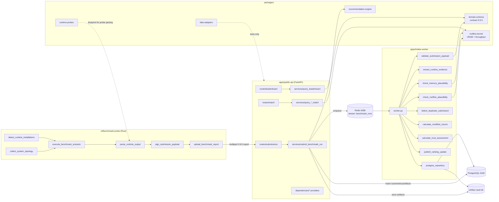

# Architecture & Code Review Map

Module dependency graph + review notes. Update when adding modules.
Runtime loop: **CLI → API → queue → worker → DB → leaderboard**.

## System graph

## Package review notes

### packages/domain-schema
Pydantic v2 domain models + report contract. `benchmark_report.py` defines
`BenchmarkReport` (schema_version pinned "0.9.0"), enums `RuntimeEngine`,
`ArtifactKind`, `MetricKind`. Tests pin the §9.3 example verbatim (incl. the
`llama.cpp`→`llama_cpp` runtime coercion at benchmark_report.py:53 — intentional,
don't remove). Contract changes go through 0.9.1 (spec L06), never silent edits.

### packages/roofline-kernel
The physics core. `roofline_kernel/estimate_vram_footprint.py` (§11.2) +
`estimate_context_limit.py`; flat `estimate_decode_throughput.py` /
`estimate_prefill_throughput.py` (§11.3/11.4, pseudocode contracts §11.5/11.6).
Constants U_RUNTIME=0.8, U_QUANT=0.9, U_TP=1.0 are engineering defaults —
changing them shifts F2 calibration; coordinate with `docs/findings.md`.
Known gaps: F3 (MoE efficiency), F4 (spec-decode ceilings), F5 (hybrid attention KV).

### packages/runtime-probes
Probe protocol + llama.cpp/Ollama stdout parsers. Isolation rule (spec S06):
third-party process calls only inside adapter files; parsers stay pure.
The Rust CLI re-implemented parsing natively — keep both in sync when engine
output formats change.

### packages/recommendation-engine
Balanced score: `robust_min_max` (p5==p95 → 1.0), feasibility
filter (§11.2 margin 0.95) then weighting; infeasible → rank_score 0 and hidden.

### packages/fake-adapters
Test doubles implementing the public-api provider interfaces (decision 13).
`FakeDatabase` pre-loads seed catalogs + leaderboard entry helper; keep its
interface in lockstep with `database_session_provider.DatabaseSession`.

## App review notes

### apps/public-api
Layering: routes (HTTP only) → services (logic) → dependencies (providers via
FastAPI Depends; PostgresSession/LocalArtifactVault/RedisStreamQueue real,
fakes in tests). Submission pipeline order in `submit_benchmark_run.py`: schema →
digest → signature → artifact digests → dedupe → insert → enqueue. Real-mode env
(internal runbook). Known: leaderboard gpu filtering only works when
hardware rows are gpu-bound (community rows are null — see spec S09 note).

### apps/intake-worker
`worker.py` orchestrates the pipeline; `postgres_repository.py` hydrates minimal
queue events from DB+vault (decision D7). Status machine: submitted →
validated | quarantined | rejected. Durability: events stay in the stream until
xack after processing. Guard F8-class bugs: run `make gate` after any change here.

### cli/benchmark-probe (Rust)
Workspace member; binary at root `target/`. Modules map 1:1 to S07/S08 spec
deliverables; `main.rs` owns arg parsing/orchestration, `lib.rs` exposes modules
for integration tests (`tests/cli_smoke.rs` drives the real binary). Signing:
PKCS8 **v1** PEM hand-encoded (D6 — don't "fix" with crate defaults).
Future: CLI v2 lab modules per `specs/en/L01-cli-v2-local-lab.md`.

## Data flow invariants (assert these when reviewing)

1. Nothing enters `benchmark_run` without passing contract validation first (API side).
2. No run reaches `validated` without the worker pipeline (never UPDATE status by hand in prod paths).
3. Artifact bytes are stored once (vault) and referenced by digest (benchmark_artifact).
4. Deduplication has TWO layers: API insertion lookup (5-dim unique index) AND
   worker dimension-group check (6-dim per §12.4) — both must stay consistent.
5. All cross-boundary serialization points (jsonb, Decimal, redis bytes, PEM) are
   bug magnets — see findings F8.
